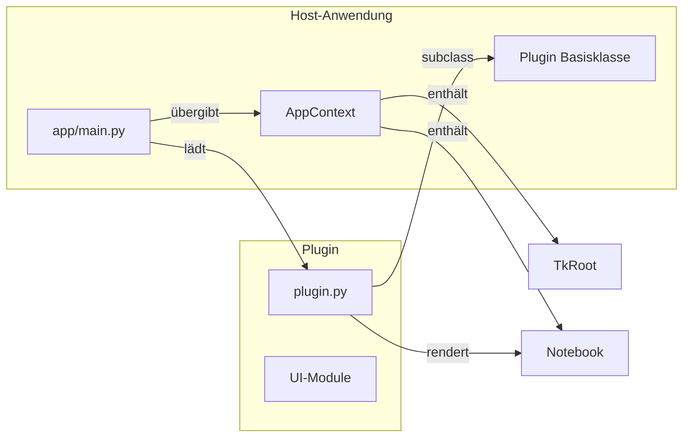

# Plugin-Schnittstelle der Heatrix Berechnungstools

Dieses Dokument beschreibt die Architektur der Host-Anwendung (`app/main.py`)
und die Anforderungen an neue Plugins. Ziel ist es, dass Entwicklerinnen und
Entwickler eigenständig Erweiterungen erstellen können, die nahtlos in das
Notebook-Layout der Berechnungstools integriert werden.

## Architekturüberblick



1. `app/main.py` verwaltet die Tk-Anwendung, lädt alle Plugins gemäß
   `PLUGIN_SPECS` und erzeugt den gemeinsamen `AppContext`.
2. Jedes Plugin implementiert die abstrakte Basisklasse aus
   `app/plugins/base.py`.
3. Über den `AppContext` erhalten Plugins Zugriff auf das Tk-Hauptfenster und
   das gemeinsame Notebook, sodass sie eigene Tabs einbetten können.

## Schnittstelle in `app/plugins/base.py`

### `AppContext`

```python
@dataclass(slots=True)
class AppContext:
    root: tk.Tk
    notebook: ttk.Notebook
```

* `root`: gemeinsames `tk.Tk`-Objekt. Hierüber können globale Optionen,
  Dialoge oder Styles konfiguriert werden.
* `notebook`: das Haupt-`ttk.Notebook`, in das jedes Plugin genau einen Tab
  einfügt.

### `Plugin` Basisklasse

Wesentliche Anforderungen, die beim Implementieren einer Unterklasse erfüllt
werden müssen:

* `name` (Klassenattribut, Pflicht): Beschriftung im Host-Notebook.
* `version` (Klassenattribut, optional): wird vom Host in Kopfbereichen oder
  Tooltips angezeigt.
* `__init__(self)`: muss `super().__init__()` aufrufen, damit die Basisklasse
  validieren kann, dass `name` gesetzt wurde.
* `attach(self, context: AppContext) -> None` (**Pflichtmethode**): erzeugt die
  komplette Oberfläche des Plugins. Typischer Ablauf:
  1. `container = ttk.Frame(context.notebook)`
  2. `context.notebook.add(container, text=self.name)`
  3. Aufbau eigener Unter-Notebooks, Frames und Widgets im Container.
* `on_theme_changed(self, theme: str) -> None` (**optional**): wird vom Host
  aufgerufen, wenn der/die Benutzer:in mit dem Theme-Schalter zwischen Hell- und
  Dunkelmodus umschaltet. Hier können Plugins Farben nachjustieren.

## Optionale Hooks

### `export_report`

Plugins können freiwillig Inhalte zu einem PDF-Bericht beitragen, der im
globalen Berichtstab aggregiert wird. Hierzu steht der Hook
`export_report(self) -> ReportSection | None` zur Verfügung. Die Rückgabe ist
eine `ReportSection`-Instanz mit folgenden Feldern:

* `title` (**Pflicht**): Abschnittstitel, der im Tab und im PDF angezeigt wird.
* `widget` (**optional**): Ein Tk-Widget, das im Berichtstab eingebettet wird.
  Das Widget sollte bereits mit einem passenden Parent erstellt worden sein und
  keine eigenen Geometry-Manager-Aufrufe ausführen.
* `html` (**optional**): HTML-ähnlicher Text, der als Paragraph in das PDF
  übernommen wird.
* `data` (**optional**): Beliebige Datenstruktur, die im Tab per `str()`
  dargestellt und im PDF ausgegeben wird.

Wird `None` zurückgegeben, erscheint das Plugin nicht im Bericht. Ausgelieferte
Plugins können so Schritt für Schritt Berichtsunterstützung nachrüsten, ohne
den Haupt-Workflow zu beeinflussen.

## Laden neuer Plugins

Plugins werden in `app/main.py` über die Liste `PLUGIN_SPECS` registriert:

```python
PLUGIN_SPECS: Sequence[tuple[str, str]] = (
    ("Isolierung.plugin", "IsolierungPlugin"),
    ("SoffeigenschaftenLuft.plugin", "StoffeigenschaftenLuftPlugin"),
    # Neuer Eintrag: ("paket.modul", "Klassenname")
)
```

* **Modulpfad**: vollqualifizierter Modulname, der den Plugin-Typ bereitstellt.
* **Attributname**: Name der Klasse, die von `Plugin` erbt.
* Beim Start ruft der Host `importlib.import_module` auf und instanziiert den
  Plugin-Typ ohne Argumente. Abhängigkeiten müssen daher innerhalb des Moduls
  verfügbar sein oder lazy geladen werden.

## Aufbau eines neuen Plugins

1. **Projektstruktur**: In jedem Tool-Verzeichnis liegt eine `plugin.py`, die
   die Brücke zwischen vorhandenen GUI-Modulen und der Host-Anwendung schlägt.
   Zusätzliche Dateien (Tabs, Logik, Assets) bleiben unverändert.
2. **Container-Frame**: Erstelle genau einen `ttk.Frame` innerhalb des
   Host-Notebooks und platziere deine Widgets darin. So bleiben Größenanpassung
   und Layout mit den anderen Plugins konsistent.
3. **Innere Notebooks oder Tabs**: Wenn das Tool mehrere Register benötigt,
   nutze ein weiteres `ttk.Notebook` im Container (siehe Beispiele
   `Isolierung` und `SoffeigenschaftenLuft`).
4. **Error Handling**: Falls dein Plugin beim Aufbau komplexe Widgets lädt,
   kapsle den Code in `try/except`, um stack traces gezielt auszugeben und den
   Host lauffähig zu halten.
5. **Theme-Unterstützung**: Implementiere `on_theme_changed`, wenn dein Plugin
   eigene Farbpaletten verwaltet. In der Methode sollte geprüft werden, ob das
   gewünschte Theme unterstützt wird.

## Minimalbeispiel

```python
# mytool/plugin.py
from tkinter import ttk
from app.plugins.base import AppContext, Plugin

class MyToolPlugin(Plugin):
    name = "MyTool"
    version = "v1.2"

    def __init__(self) -> None:
        super().__init__()
        self._notebook: ttk.Notebook | None = None

    def attach(self, context: AppContext) -> None:
        container = ttk.Frame(context.notebook)
        container.columnconfigure(0, weight=1)
        container.rowconfigure(0, weight=1)
        context.notebook.add(container, text=self.name)

        ttk.Label(container, text="Hello MyTool").grid(row=0, column=0)

    def on_theme_changed(self, theme: str) -> None:
        if theme == "dark":
            ...  # Styles anpassen
```

Nach dem Hinzufügen des Moduls zur `PLUGIN_SPECS`-Liste steht das Plugin im
Host-Notebook zur Verfügung. Weitere Beispiele finden sich in
`Isolierung/plugin.py` und `SoffeigenschaftenLuft/plugin.py`.
